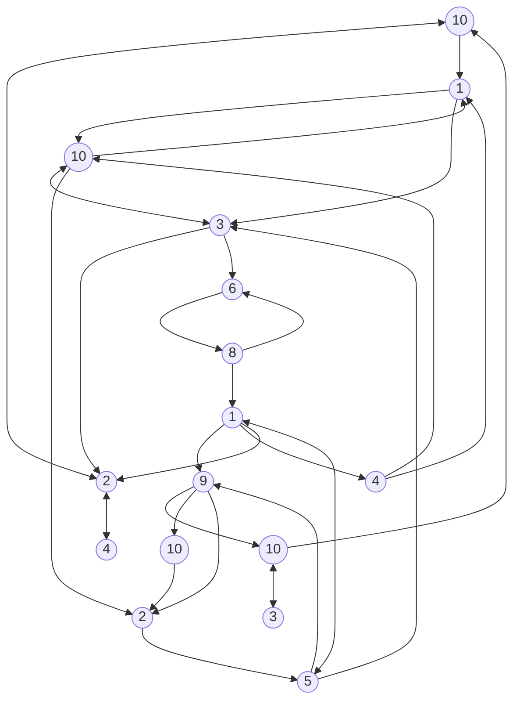

# NLP Internship Test
This is a 2-part test. The tasks are somewhat open-ended, so please complete to the best of your abilities - there is no "wrong" answer.

# Part 1 - Using NLP Models
In the `Task1-Data` directory, there is a `US-Stocks.json`, and some scraped NLP documents. Using a [hugging face]('https://huggingface.co/') model of your choice, extract from the data the sentiment of the document in relation to each US Stock (i.e. if a document is positive, or negative for each stock).

# Part 2 - Graph Theory

Below is a simple unweighted directed graph. Write an algorithm in pseudocode (English) to find as many nodes with score 10 as you can, in the fewest moves as you can.

The rules are as follows:
- You do not know the score of a node unless visited.
- You can only remember the scores of the previous 5 nodes visited.
- An move is defined.
- Your performance will be calculated as `number of visited 10s/number of actions`

